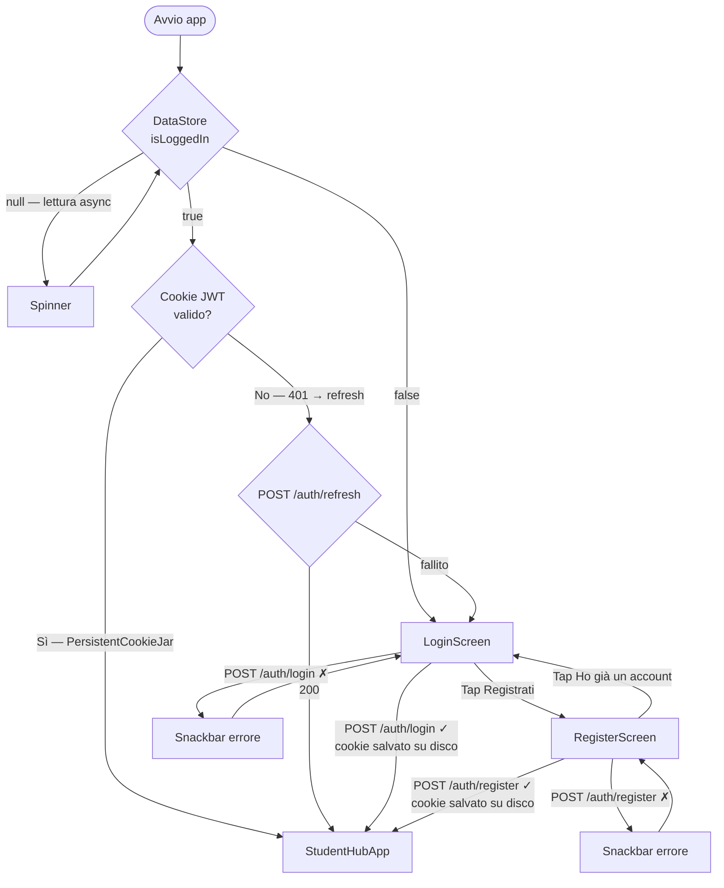
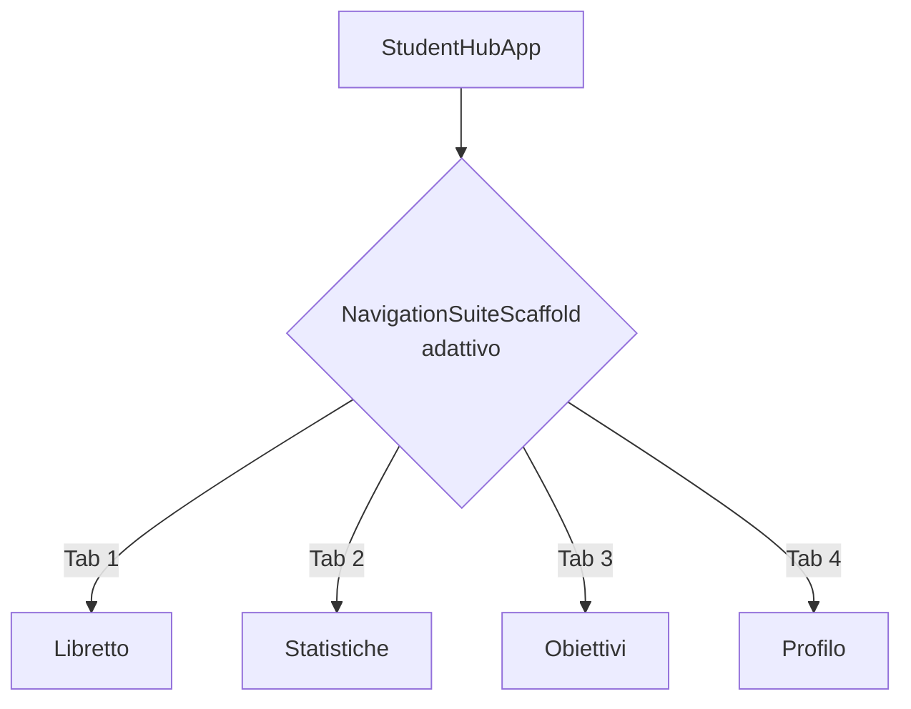
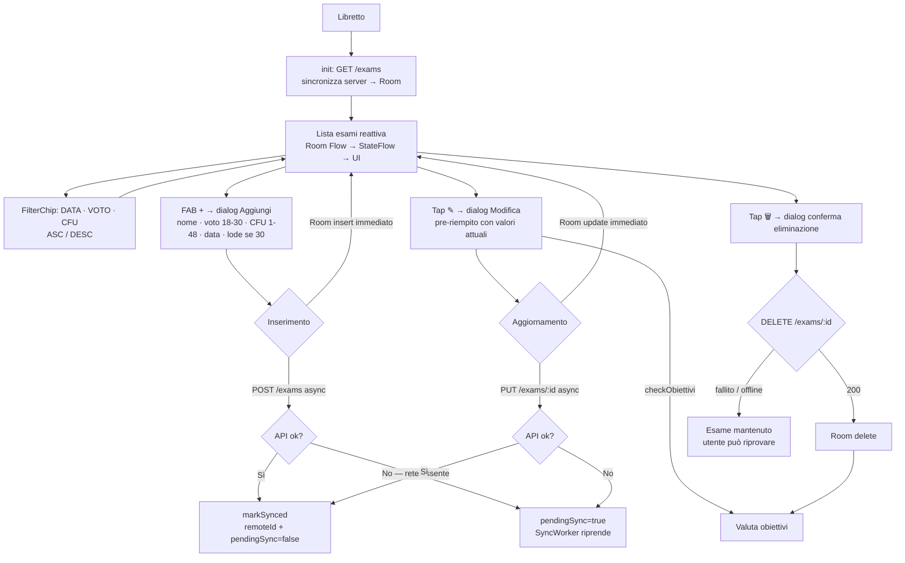
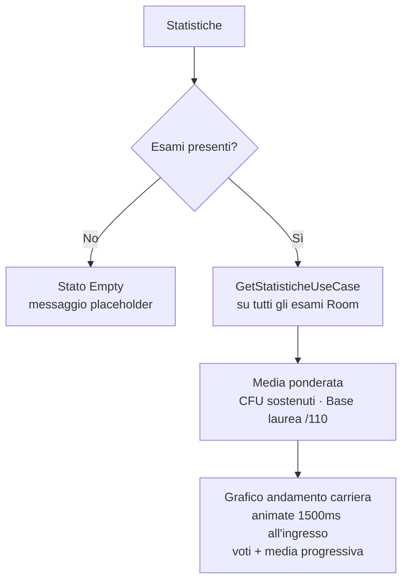
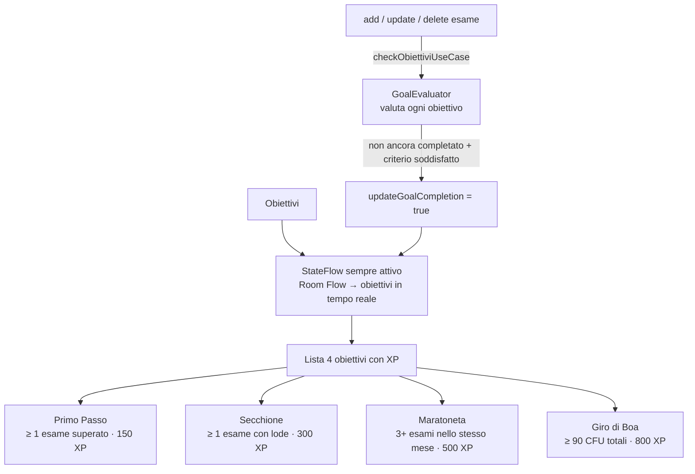
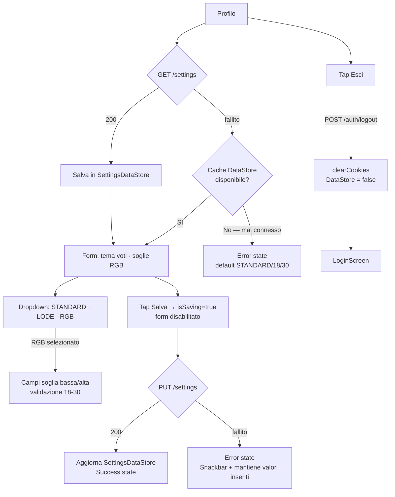
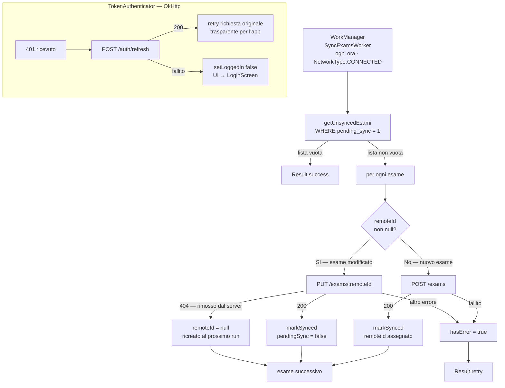

# StudentHub Android

> App Android per la gestione della carriera universitaria con gamification. Kotlin · Clean Architecture · MVVM · Jetpack Compose · Room · WorkManager. UniBO Sistemi Mobili 2025/26.

---

## Panoramica

**StudentHub** è un'applicazione Android nativa che permette agli studenti di tracciare esami, CFU e media ponderata, monitorare obiettivi di gamification e sincronizzare i dati con il backend StudentHub (Node.js / MySQL).

Progetto finale per il corso di **Sistemi Mobili** — Università di Bologna, 2025/2026.

---

## Stack Tecnologico

| Layer | Tecnologia |
|-------|-----------|
| Linguaggio | Kotlin 2.2.10 (100%, no Java) |
| Architettura | Clean Architecture multi-modulo |
| Pattern UI | MVVM — ViewModel + StateFlow |
| UI Toolkit | Jetpack Compose + Material Design 3 |
| Navigazione | `NavigationSuiteScaffold` adattivo (phone / tablet / desktop) |
| Async | Kotlin Coroutines + Flow |
| DB locale | Room 2.7.2 |
| Preferenze | DataStore (Preferences) |
| Networking | Retrofit 2 + OkHttp 4 + TokenAuthenticator |
| Background | WorkManager (sync offline-first) |
| Test | JUnit 4 + Mockito-Kotlin + kotlinx-coroutines-test |
| Min SDK | 31 (Android 12) |
| Target SDK | 36 |

---

## Architettura

Il progetto segue la **Clean Architecture** con separazione rigorosa in 4 moduli Gradle:

```
:app        → Entry point, CustomApplication, DI manuale (RepositoryProvider)
:domain     → Use Cases, interfacce Repository, Domain Models (Kotlin puro, zero import Android)
:data       → RepositoryImpl, Room DAO/Entity, DataStore, Retrofit services, WorkManager Worker
:ui         → Composable screens, ViewModel, tema Material You
```

**Dipendenze tra moduli:**
```
:app  →  :ui, :domain, :data
:ui   →  :domain
:data →  :domain
:domain  →  (nessuna dipendenza interna)
```

**Flusso dei dati (reattivo):**
```
Composable
  └── ViewModel  [:ui]              ← collectAsStateWithLifecycle()
        └── UseCase  [:domain]      ← StateFlow / stateIn()
              └── Repository (interfaccia)  [:domain]
                    └── RepositoryImpl  [:data]
                          ├── Room DAO      → Flow<T> (Room emette aggiornamenti automatici)
                          └── Retrofit API  → suspend fun (Dispatchers.IO)
```

---

## Struttura del Progetto

```
studenthub-android/
├── app/
│   └── src/main/java/com/unibo/android/studenthub/
│       └── CustomApplication.kt          ← RepositoryProvider + WorkManager bootstrap
├── domain/
│   └── src/main/java/com/unibo/android/domain/
│       ├── model/                         ← Esame, Statistiche, Obiettivo, Settings, User
│       ├── repository/                    ← interfacce: EsameRepository, AuthRepository, …
│       └── usecase/                       ← GetEsamiUseCase, LoginUseCase, SyncWorker, …
├── data/
│   └── src/main/java/com/unibo/android/data/
│       ├── local/                         ← Room: StudentHubDatabase, DAO, Entity, Mapper
│       ├── remote/                        ← Retrofit: AuthApiService, ExamApiService, …
│       ├── repository/                    ← implementazioni repository
│       └── worker/                        ← SyncExamsWorker (WorkManager)
├── ui/
│   └── src/main/java/com/unibo/android/ui/
│       ├── screens/
│       │   ├── auth/                      ← LoginScreen, RegisterScreen, AuthViewModel
│       │   ├── libretto/                  ← LibrettoScreen, LibrettoViewModel, EsameCard
│       │   ├── statistiche/               ← StatisticheScreen, StatisticheViewModel
│       │   ├── obiettivi/                 ← ObiettiviScreen, ObiettiviViewModel
│       │   └── profilo/                   ← ProfiloScreen, ProfiloViewModel
│       ├── theme/                         ← StudentHubTheme, Color, Type
│       └── MainActivity.kt               ← NavigationSuiteScaffold, RootNavigation
├── gradle/
│   └── libs.versions.toml
└── settings.gradle.kts
```

---

## Flussi Utente

### Autenticazione



---

### Navigazione principale



---

### Libretto Esami



---

### Statistiche



---

### Obiettivi



---

### Profilo e Impostazioni



---

### Sincronizzazione Background



---

## Schermate

| Tab | Schermata | Funzionalità principali |
|-----|-----------|------------------------|
| — | **Login** | Email + password, toggle visibilità, Snackbar errore server, link a Registrazione |
| — | **Registrazione** | Nome, cognome, email, password, Snackbar errore, link a Login |
| 1 | **Libretto** | Lista reattiva, sort DATA/VOTO/CFU × ASC/DESC, aggiunta/modifica/eliminazione esame con dialog, sync offline-first |
| 2 | **Statistiche** | Media ponderata, CFU totali, base laurea, grafico animato andamento voti + media progressiva |
| 3 | **Obiettivi** | 4 achievement con XP, stato completato/non completato aggiornato in tempo reale |
| 4 | **Profilo** | Tema voti (STANDARD/LODE/RGB), soglie RGB, salvataggio con cache offline, logout |

---

## Avvio del Progetto

### Prerequisiti

- Android Studio Meerkat o successivo
- JDK 11+
- Dispositivo o emulatore API 31+

### Build

```bash
git clone https://github.com/diegoandruccioli/studenthub-android.git

# Build completo + test
./gradlew clean build

# Solo test unitari
./gradlew test

# Installa su dispositivo/emulatore connesso
./gradlew installDebug
```

---

## Connessione al Backend

L'app punta a `http://10.0.2.2:3010/api/` (configurata in `NetworkClient.kt`).

### Emulatore Android Studio
1. Avvia il [backend StudentHub](https://github.com/diegoandruccioli/StudentHub) sulla porta `3010`
2. Avvia l'emulatore — nessuna modifica necessaria (`10.0.2.2` è il `localhost` dell'host)

### Dispositivo fisico
1. Computer e telefono sulla **stessa rete Wi-Fi**
2. Trova l'IP locale del computer (es. `192.168.1.x`)
3. In `data/src/main/java/com/unibo/android/data/remote/NetworkClient.kt` modifica:
   ```kotlin
   private const val BASE_URL = "http://<ip-del-tuo-computer>:3010/api/"
   ```

---

## Strategie di Persistenza

| Dato | Tecnologia | Comportamento offline |
|------|------------|----------------------|
| Esami | Room (SQLite) | Fonte di verità locale; sync via `pendingSync` flag + SyncWorker |
| Sessione utente | DataStore Preferences | `is_logged_in` flag persistito; cookie JWT persistito su SharedPreferences |
| Settings profilo | DataStore Preferences | Cache post GET/PUT; fallback automatico se server non raggiungibile |
| Cookie JWT | `PersistentCookieJar` (SharedPreferences) | Sopravvive ai riavvii; `TokenAuthenticator` gestisce il rinnovo su 401 |

---

## Conformità ai Requisiti del Corso

| Requisito | Stato |
|-----------|-------|
| Clean Architecture multi-modulo (domain / data / ui / app) | ✅ |
| MVVM — ViewModel unico state holder, no logica di business in View | ✅ |
| ViewModel sopravvive ai cambi di configurazione | ✅ |
| Use Cases nel layer domain — singola responsabilità | ✅ |
| Repository Pattern — unico punto di accesso ai dati | ✅ |
| Kotlin Coroutines — Main Thread mai bloccato | ✅ |
| Room — persistenza dati strutturati | ✅ |
| DataStore — preferenze chiave-valore (sessione + settings) | ✅ |
| Jetpack Compose con LazyColumn + `key` stabile | ✅ |
| Almeno 2 chiamate API remote | ✅ (10 endpoint implementati) |
| WorkManager — sync background offline-first | ✅ (opzionale 3) |
| Runtime Permissions | 🔲 (dichiarata, da implementare) |
| Relazione scritta | ✅ (`docs/relazione/relazione.tex`) |

---

## Test

38 test unitari distribuiti su `:domain` e `:ui`, zero failures.

```bash
./gradlew test
```

| Suite | Modulo | Test |
|-------|--------|------|
| `AuthUseCaseTest` | :domain | Login/register successo e fallimento |
| `GoalEvaluatorTest` | :domain | Tutti e 4 i GoalEvaluator con casi limite |
| `GetStatisticheUseCaseTest` | :domain | Media ponderata, CFU, baseLaurea, andamento |
| `LibrettoViewModelTest` | :ui | CRUD esami, sort, trigger obiettivi |
| `ProfiloViewModelTest` | :ui | Caricamento/salvataggio settings, logout |
| `StatisticheViewModelTest` | :ui | Empty state, Success, Error |

---

## Licenza

Progetto accademico — Università di Bologna, 2025/2026.
